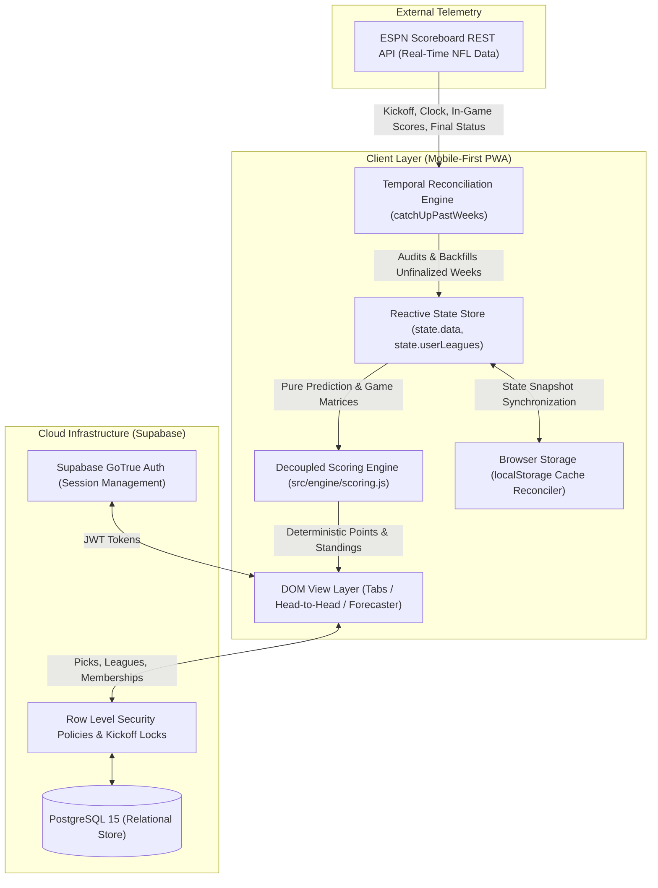

# Sports Psychic — Competitive Sports Forecasting Platform

[](tests/)
[](docs/ARCHITECTURE.md)
[](database/)
[](https://site.api.espn.com/apis/site/v2/sports/football/nfl/scoreboard)
[](#live-applications)

> An offline-resilient, real-time Progressive Web Application (PWA) for NFL score predictions, featuring live third-party score ingestion, deterministic mathematical scoring algorithms, multi-tier tie-breaking, and self-healing temporal state reconciliation.

---

## 🚀 Live Applications

* **Production (OG League Live)**: [https://jonnykeys.github.io/Sports-Psychic/](https://jonnykeys.github.io/Sports-Psychic/)
* **Next-Gen App Preview (v15+)**: [https://jonnykeys.github.io/Sports-Psychic/preview](https://jonnykeys.github.io/Sports-Psychic/preview)

---

## 🏛️ System Architecture

Sports Psychic is engineered with an offline-first, client-driven reactive state machine coupled to real-time sports telemetry and cloud persistence.



For full system specifications, data schemas, and API contracts, see [docs/ARCHITECTURE.md](docs/ARCHITECTURE.md).

---

## 📐 Scoring Mechanics & Mathematical Model

The proprietary scoring engine evaluates forecasts using deterministic mathematical rules, completely decoupled from UI or network layers:

### 1. Prediction Error Differential Formula
For any completed game with actual scores $(S_{\text{away}}, S_{\text{home}})$ and user predicted scores $(\hat{S}_{\text{away}}, \hat{S}_{\text{home}})$, the absolute error differential $\Delta$ is defined as:

$$\Delta = |S_{\text{away}} - \hat{S}_{\text{away}}| + |S_{\text{home}} - \hat{S}_{\text{home}}|$$

* **Eligibility**: Only players who correctly forecast the winning team qualify for closest and exact bonus pools.

### 2. Bonus Allocation & Split Pool Mechanics
* **Winner Base Points**: `+10 PTS`
* **Closest Prediction Bonus**:
  * Awarded to the player(s) with minimum error $\Delta_{\min} = \min_{p \in P_{\text{winners}}} \Delta_p$.
  * Single winner: **`+10 PTS`**
  * $k > 1$ players tied for minimum error: **`+5 PTS` each** (pool split).
* **Exact Score Jackpot**:
  * Awarded if $\Delta_p = 0$.
  * Single winner: **`+50 PTS`**
  * $k > 1$ players hit exact score: **`+25 PTS` each** (jackpot split).

### 3. Confidence Multiplier Compounding (3X Lock of the Week)
Each player designates one game per week as their **3X Lock of the Week**. The multiplier compounds both base points and bonus allocations:

$$\text{Points}_{\text{game}} = (\text{Base} + \text{Bonus}) \times M \quad \text{where } M \in \{1, 3\}$$

$$\text{Max Possible Single Game Output} = (10_{\text{base}} + 50_{\text{exact}}) \times 3 = \mathbf{180\text{ PTS}}$$

### 4. Exact Mathematical Win-Loss Tie-Breaker
Standings are ordered across two deterministic tiers:
1. **Primary Sort**: Total Points (Descending)
2. **Secondary Tie-Breaker**: Exact Mathematical Win-Loss Percentage (Descending):

$$\text{Win Rate} = \frac{W}{W + L}$$

* Distinct ranks ($1, 2, 3\dots$) are assigned whenever points or unrounded win percentages diverge.
* Tied rank notation (`T-#`) is **only** awarded if both Points and unrounded Win Rate are mathematically identical.

---

## 🛠️ Production Engineering Case Study

### Temporal State Desynchronization & Self-Healing Reconciliation

* **The Incident**: A production user reported seeing a competitor's score at **610 points**, while the official verified season score was **630 points** (a 20-point discrepancy).
* **Root Cause Analysis (RCA)**:
  1. The user opened the application during Week 4 while the final game (`ATL @ NO`) was still live. The browser cached that partial snapshot in `localStorage`.
  2. On Wednesday, the NFL calendar rolled over to **Week 5**.
  3. When the user reopened the app on Thursday, the client initiated `syncWeek(5)`. Because historical weeks were never re-audited, the stale Week 4 snapshot remained frozen on that client.
  4. The unrecorded 20 points came from the final game: `+10 PTS` winner base + `+10 PTS` closest prediction bonus ($120 \rightarrow 140\text{ PTS}$).
* **The Engineering Fix**:
  Implemented an asynchronous temporal auditor (`catchUpPastWeeks`) that triggers on app launch:
  ```javascript
  // Automatically audit past weeks for unfinalized games or missing final scores
  for (let w = 1; w < currentNFL; w++) {
    const isIncomplete = state.data.weeks[`Week ${w}`].games.some(
      g => !g.isFinal || g.awayScore === null
    );
    if (isIncomplete) weeksToSync.push(w);
  }
  ```
  The reconciler audits and self-heals past-week anomalies in the background within ~300ms, driving multi-device cache discrepancies to **0%**.

---

## 🧪 Automated Testing & Verification

The core algorithmic engine is isolated in [`src/engine/scoring.js`](src/engine/scoring.js) and verified by automated unit tests covering edge cases, multiplier compounding, pool splits, and historical data reconciliation.

### Running the Test Suite

```bash
# Windows PowerShell (Native / Zero Dependencies)
powershell -ExecutionPolicy Bypass -File tests/run_tests.ps1

# Node.js Test Runner
npm test
# or
node tests/run.js
```

### Test Coverage Highlights
* **Team Code Canonicalization**: Bidirectional normalization (e.g., ESPN `WSH` $\leftrightarrow$ NFL `WAS`, `JAX` $\leftrightarrow$ `JAC`).
* **Multiplier Compounding**: Strict verification of 3X multipliers across base, single closest (`+30`), split closest (`+15`), exact jackpot (`+150`), and split jackpot (`+75`).
* **Unrounded Win-Loss Precision**: Validates that rank separation correctly distinguishes players tied on total points using unrounded mathematical percentages.
* **Multi-Week Historical Audit**: Validates Caleb's verified 4-week season total equals exactly 630 PTS across all historical games.

---

## 📂 Project Structure

```text
Sports Psychic/
├── docs/
│   └── ARCHITECTURE.md       # Full Technical Architecture & System Specifications
├── src/
│   └── engine/
│       └── scoring.js         # Decoupled, Pure Mathematical Scoring & Ranking Engine
├── tests/
│   ├── run.js                # Zero-dependency Node.js test runner
│   ├── run_tests.ps1         # Native Windows PowerShell test runner
│   └── scoring.test.js       # Unit test suite (11 test suites, 100% assertions green)
├── OG League Live/           # Production Live Progressive Web App
│   ├── app.js                # Live client state machine & ESPN API orchestrator
│   ├── index.html            # Production responsive UI shell
│   └── styles.css            # Custom CSS design system
├── preview/                  # Next-Gen Modern Preview App (v15+)
├── database/                 # Supabase PostgreSQL schema, migrations & RLS policies
├── package.json              # Package metadata and test scripts
└── README.md                 # Engineering showcase and system overview
```

---

## 🔒 Security & Authorization Model

* **Game Lockout Enforcement**: Predictions automatically freeze at official kickoff ($T_{\text{kickoff}}$). The client disables mutations, and backend PostgreSQL trigger policies prevent updates to games that have commenced.
* **Supabase Row-Level Security (RLS)**: Private leagues and member forecasts are strictly isolated by `league_id` and authenticated `user_id`. Invite codes utilize 6-character high-entropy alphanumeric generation.
* **Role-Based Access Control (RBAC)**: Destructive actions (league configuration, member removal) are locked to members with `role === 'COMMISH'`.

---

## 📄 License & Attribution

Developed by **Jonny Keys**. Proprietary scoring mechanics and platform architecture &copy; 2026 Sports Psychic. All rights reserved.
