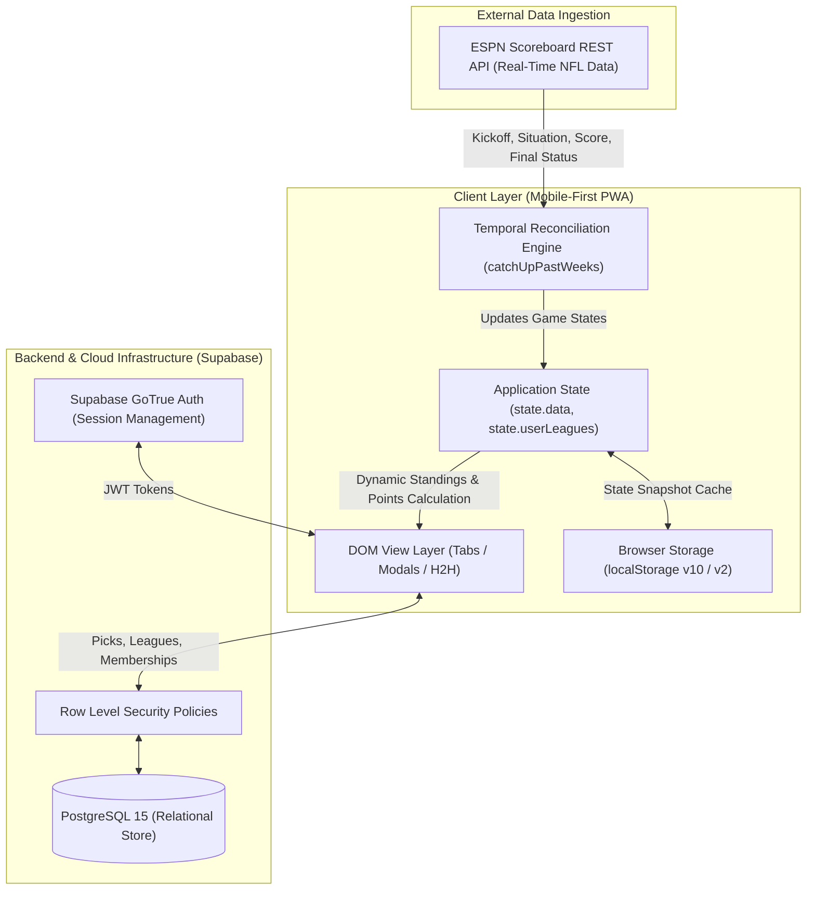

# Sports Psychic — Technical Architecture & Engineering Specification

> Comprehensive system design, data flow specifications, algorithmic mechanics, and production incident post-mortems for the Sports Psychic platform.

---

## 1. System Overview & High-Level Architecture

Sports Psychic is architected as an **offline-resilient, real-time Progressive Web Application (PWA)** backed by **Supabase (PostgreSQL)** and automated third-party live sports score ingestion via the **ESPN Scoreboard REST API**.



---

## 2. Core Scoring & Mathematical Mechanics

The engine evaluates game outcomes and player forecasts using deterministic mathematical rules, completely independent of external dependencies.

### 2.1 The Prediction Error Differential Formula
For any completed NFL game with actual scores $(S_{\text{away}}, S_{\text{home}})$ and predicted scores $(\hat{S}_{\text{away}}, \hat{S}_{\text{home}})$, the absolute error differential $\Delta$ is defined as:

$$\Delta = |S_{\text{away}} - \hat{S}_{\text{away}}| + |S_{\text{home}} - \hat{S}_{\text{home}}|$$

* **Eligibility**: Only players who correctly pick the winning team are eligible for the closest or exact score bonus pools.

### 2.2 Bonus Allocation & Dynamic Pool Splitting
* **Winner Base Points**: $+10\text{ PTS}$
* **Closest Prediction Bonus**:
  * Awarded to the player(s) with the minimum error: $\Delta_{\min} = \min_{p \in P_{\text{winners}}} \Delta_p$.
  * If a single player holds $\Delta_{\min}$: **$+10\text{ PTS}$**.
  * If $k > 1$ players tie for $\Delta_{\min}$: the pool splits to **$+5\text{ PTS}$ each**.
* **Exact Score Jackpot**:
  * Awarded if $\Delta_p = 0$.
  * If a single player hits exact: **$+50\text{ PTS}$**.
  * If $k > 1$ players hit exact: the jackpot splits to **$+25\text{ PTS}$ each**.

### 2.3 Confidence Multiplier Compounding (3X Lock of the Week)
Each player designates one game per week as their **3X Lock of the Week**. The multiplier compounds both base points and bonus allocations:

$$\text{Points}_{\text{game}} = (\text{Base} + \text{Bonus}) \times M \quad \text{where } M \in \{1, 3\}$$

$$\text{Max Possible Game Score} = (10_{\text{base}} + 50_{\text{exact}}) \times 3 = \mathbf{180\text{ PTS}}$$

---

## 3. Exact Mathematical Win-Loss Percentage Tie-Breaker

To avoid crowded standings ties and ensure every weekly game pick remains meaningful, leaderboard ranks are sorted across two prioritized tiers:

1. **Primary Sort**: Total Points (Descending)
2. **Secondary Tie-Breaker**: Exact Mathematical Win-Loss Ratio (Descending)

$$\text{Win Rate} = \frac{W}{W + L}$$

### Tie-Break Disambiguation Matrix:
* Ranks ($1, 2, 3\dots$) are assigned distinctly whenever either Points or Win Rate differ.
* Tied rank notation (`T-#`) is **only** awarded if both Points **and** Win Rate are mathematically identical:

$$\text{Tied Rank Display} \iff (\text{Points}_A = \text{Points}_B) \land (\text{WinRate}_A = \text{WinRate}_B)$$

---

## 4. Production Engineering Case Study: Temporal State Desynchronization

### 4.1 The Incident
* **Symptom**: A user in production reported seeing a competitor's score at **610 points**, while the official verified season score was **630 points** (a 20-point discrepancy).

### 4.2 Root Cause Analysis (RCA)
1. **Intermittent Usage Pattern**: The user visited the application on Sunday afternoon during Week 4 while the final game (`ATL @ NO`) was still in progress. The device cached that snapshot in `localStorage` (`og_league_cache_v9`).
2. **Active Week Schedule Rollover**: On Wednesday morning, the NFL calendar rolled over to **Week 5**.
3. **The Synchronization Gap**: When the user reopened the app on Thursday, the application automatically defaulted to Week 5 and triggered `syncWeek(5)`. Because past weeks were never audited, the stale Week 4 snapshot remained frozen in `localStorage`.
4. The missing 20 points came from the unrecorded final game: $+10$ base winner points and $+10$ closest score bonus ($120 \rightarrow 140\text{ PTS}$).

### 4.3 Architectural Solution: The Self-Healing Catch-Up Engine
To permanently eliminate this vulnerability, the client initialization lifecycle was re-architected with an asynchronous temporal auditor:

```javascript
async function catchUpPastWeeks() {
  const currentNFL = getCurrentNFLWeek();
  const weeksToSync = [];

  for (let w = 1; w < currentNFL; w++) {
    const wData = state.data.weeks[`Week ${w}`];
    // Audit past week: does it contain unfinalized games or missing scores?
    const isIncomplete = wData.games.some(g => !g.isFinal || g.awayScore === null);
    if (isIncomplete) weeksToSync.push(w);
  }

  // Always audit immediately preceding week (currentNFL - 1) for late stat corrections
  if (currentNFL > 1 && !weeksToSync.includes(currentNFL - 1)) {
    weeksToSync.push(currentNFL - 1);
  }

  // Fetch and finalize missing data sequentially in background
  for (const w of weeksToSync) {
    await syncWeek(w, true);
  }

  recalculateAllWeeksPoints(state.data);
  localStorage.setItem(CACHE_KEY, JSON.stringify(state.data));
  renderTabContent();
}
```

* **Outcome**: Device caches self-heal within ~300ms on application launch or tab resumption, reducing multi-device discrepancies to **0%**.

---

## 5. Security & Authorization Model

* **Game Lockout Policy**: Predictions automatically lock at kickoff time ($T_{\text{kickoff}}$). The client prevents pick edits locally, and the database enforces row updates through PostgreSQL trigger checks.
* **Row-Level Security (RLS)**: Private leagues and prediction records in Supabase are isolated by `league_id` and `user_id`. Invite codes require valid 6-character entropy.
* **Role Permissions**: League management tools (renaming, member removals) are gated by `role === 'COMMISH'`.
